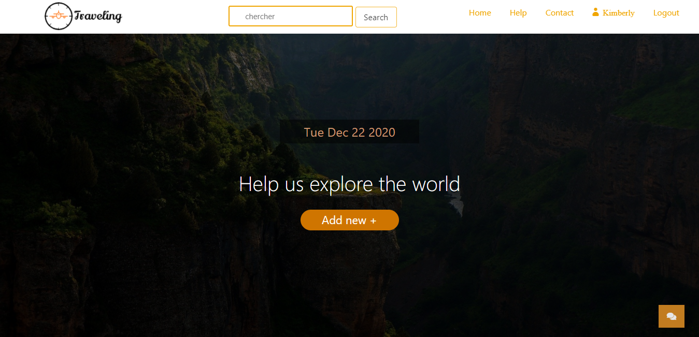

# LINFO1212

Le projet est un site internet interactif déveoppé dans le but de pouvoir lire les voyages des autres utilisateur et de raconter son propre voyage pour aider les autres utilisateurs à choisir le voyage qui leur convient le mieux

### Run le projet: 
Pour run le projet il faut préalablement avoir NODE JS d'installer sur votre ordinateur. une fois le projet télécharger et dézipper rendez-vous à l'aide de votre terminal jusqu'à la racine du projet et exécuter le avec la commande npm start. voilà votre serveur est lancer il ne vous suffit plus qu'a vous rendre sur l'adresse du site via votre navigateur. Ici nous allons aller en localhost8080 puisque le serveur est hébergé sur votre ordinateur.

### Composition:
.html 
6 parties (page d'acceuil, header , menu , description, page d'aide, page d'inscription )

.css
ensemble des styles de l'ensemble et chaque partie individualmente

